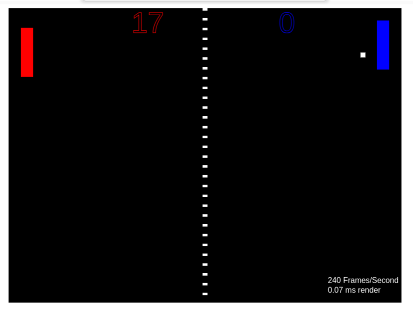

<div align="center">


<h3>Running C/C++ in the Browser</h3>

<p>WebAssembly examples</p>

</div>


#### WebAssembly 

Wasm is a binary instruction format for a stack-based virtual machine. The code can be run in modern browsers to run compiled codes like C++, Rust, Go, etc. on the client.

WebAssembly is designed to complement and run alongside JavaScript, sharing functionality between them.


#### Prerequisites

Install GCC/g++ compilers required to compile C++ programs in Linux

```sh
sudo apt install build-essential
```

Install or Update Emscripten

```sh
git clone https://github.com/emscripten-core/emsdk.git  --> download Emscripten if you haven't already

cd emsdk
./emsdk update  --> update Emscripten is you already have it installed
./emsdk install latest
./emsdk activate latest  --> configuration files
source ./emsdk_env.sh  --> set Emscripten into your current console

emcc -v
emcc --version
```


#### Hello World Example

In a browser we going to run the main() C++ function in hello.cpp.

```sh
emcc hello.cpp -o hello.html --emrun
emrun hello.html
```

emcc, the Emscripten compiler, compiles hello.cpp into a binary `hello.wasm` file which is instantiated by `hello.js` glue code.

emrun is a local web sever and test tool used to host and launch the compliled html and WebAssembly files.

And that's it. We are using hello.js glue code to run C code into the browser.


### Calling C/C++ functions from Javascript

<div align="center">



<h4>Ping Pong example</h4>

</div>

From a Ping-Pong game entirely in JS (/original/pong.js), we will migrate some functions to pong.cpp and use them from there.

To do this, we will use a tool called embind (part of the Emscripten toolchain, --bind option)

```sh
emcc pong.cpp -o pong_wasm.js --std=c++17 --bind
emrun pong.html --no_emrun_detect
```

The directory structure is as follows:
  - /original, the ping-pong game in its original JS and html files.
  - /start, the initial modifications to make the wasm module work
  - /embind_classes, C++ functions and classes can be linked with Emscripten
  - /dom_control, defining JS functions inside C/C++ code
  - /final, 

`pong_wasm.js` instantiates a variable `Module` which enables the use of the functions and classes defined in C/C++.
Read the comments at the begining of any JS glue code to learn how to use the variable.<br>
Here we use the 4th option. In `pong.html` we define a Module variable to execute render().<br>
Then the "pong_wasm.js" adds to it all the C++ functions and classes we going to use.

Note also that pong.html use Emscripten event `onRuntimeInitialized` to delay function calls until the Wasm artifact is fully loaded.

In pong.js we execute Module.getAIMove() wich is the functions we move to pong.cpp.


#### Passing Complex Data with Embind

Embind supports classes, pointers, arrays, smart pointers, memory views, inheritance and polymorphism.<br>

Compare /start/pong.cpp and /embind_classes/pong.cpp and see how emscripten manage enums, value objects, classes and functions.

You can also write JS functions inside C/C++. In /dom_control/pong.html we can see how the "<canvas>" tag has been removed and included bia "drawCanvas" a JS function inside C++ code. This type of js block must be declared using `EM_JS` emscripten tool. The function is executed calling "createInitialGameState()" in /dom_control/pong.cpp


#### WebAssembly Modules

In the JS glue code Emscripten instantiates a variable `Module` which enables the use of the functions and classes defined in C/C++.<br>
By default the glue code loads the module globally, causing multiple instances to collide.


You can compile a factory module to work with node.js.

```sh
emcc hello.cpp -o hello.js -O3 -s MODULARIZE -s EXPORT_ES6
```

Then in your app's entry module:

```js
import "./hello.js";
```

This allows us to produce multiple instances of the module. By default the glue code loads the module globally, causing multiple instances to collide.

If your output extension is .js and not .mjs, then you have to add `-s EXPORT_ES6` to output a JavaScript module.

The module contains a Preamble which defines a set of useful functions like:
 * getValue/setValue
 * ccall/cwrap
 * string conversion functions
 * heap accessors

```js
// pre.js:
Module['print'] = function(text) { console.log('stdout: ' + text) };
```

Now you can compile with Emscripten adding the preamble at the begining of the JS glue code.

```sh
emcc hello.cpp -o hello.html --emrun --pre-js pre.js
emrun hello.html
```

In your browser console type Module and see all the functions it provides.<br>
In the browser console run Module.print('Jelou from MaLa')


#### Performing in Parallel

Any C++ code that is using `pthreads` or std::threads can be ported to WebAssembly.<br>
Use SharedArrayBuffer and Web Workers to achieve parallelism (The browser must support them).<br>
Complie with `-s USE_PTHREADS=1`


#### Docs

[Webassembly](/docs/webassembly.md) <br>
[Web Workers](/docs/web_workers.md) <br>
[Wasm Workers](/docs/wasm_workers.md) <br>
